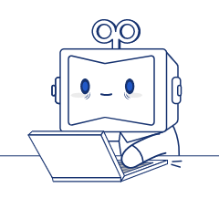

# css 常见样式

## 文本溢出

<DemoContainer title="示例： 单行文本溢出 & 多行文本溢出">
 <div class="text" >飞流直下三千尺， 疑是银河落九天</div>
 <br/>
 <div class="text-more" >
 日照香炉生紫烟，
 遥看瀑布挂前川。
飞流直下三千尺，
疑是银河落九天。
</div>
 <style>
    .text {
      overflow: hidden;
        text-overflow:ellipsis;
        white-space: nowrap;  
        width: 100px;
    }
        .text-more {
      margin-left: 100px;
      display: -webkit-box;
      -webkit-box-orient: vertical;
      -webkit-line-clamp: 3;
      text-overflow: ellipsis;
      overflow: hidden;
     width: 100px;
    }
 </style>

</DemoContainer>

```css
/* 单行文本溢出 */
overflow: hidden;
text-overflow: ellipsis;
white-space: nowrap;
```

```css
/* 多行文本溢出 */
display: -webkit-box;
-webkit-box-orient: vertical;
-webkit-line-clamp: 3;
overflow: hidden;
text-overflow: ellipsis;
```

## 水平垂直居中(推荐 3 种)

```html
<div class="father">
  <div class="son"></div>
</div>
```

```css
/* 1. margin auto */
.father {
  position: relative;
}
.son {
  position: absolute;
  top: 0;
  left: 0;
  right: 0;
  bottom: 0;
  margin: auto;
}
```

```css
/* 2. absolute + transform */
.father {
  position: relative;
}
.son {
  position: absolute;
  left: 50%;
  top: 50%;
  transform: translate(-50%, -50%);
}
```

```css
/* 3. flex */
.father {
  display: flex;
  justify-content: center;
  align-items: center;
}
.son {
}
```

## 其他常见样式

<style lang="scss">
    .text-unselect {
        user-select: none;
    }
    .is-gray {
        filter: grayscale(1);
    }
    .tri {
        width: 0px;
        height: 0px;
        border: 50px solid transparent;
        border-bottom-color: #000;
    }
    .arrow-right{
        width: 0;
        height: 0;
        position: relative;
        border: 50px solid transparent; 
        border-left-color: #000;   
        &::after{
        content: '';
        position: absolute;
        top: -50px;
        left: -58px;
        border: 50px solid transparent;
        border-left-color: #fff;
    }
}
    .oval {
        margin-top: 50px;
        width: 100px;
        height: 50px;
        background: #000;
        border-radius: 50px / 25px;
    }
    .tri2 {
         margin-top: 50px;
        width: 0;
    height: 0;
    border-top: 50px solid #000;
border-left: 50px solid transparent;
    }
    .star {
     width: 0;
    height: 0;
    border-bottom: 70px solid #000;
    border-right: 100px solid transparent;
    border-left: 100px solid transparent;
    transform: rotate(35deg) scale(0.5);
    &::before {
    content: '';
    position: absolute;
    top: -45px;
    left: -65px;
    width: 0;
    height: 0;
    border-bottom: 80px solid #000;
    border-left: 30px solid transparent;
    border-right: 30px solid transparent;
    transform: rotate(-35deg);
    }
    &::after {
    content: '';
    position: absolute;
    top: 3px;
    left: -105px;
    border-bottom: 70px solid #000;
    border-left: 100px solid transparent;
    border-right: 100px solid transparent;
    transform: rotate(-70deg);
}

    }
.heart {
      position: relative;
    width: 100px;
    height: 90px;
    &::before {
    content: '';
    position: absolute;
    left: 50px;
    width: 50px;
    height: 80px;
    background: red;
    border-radius: 50px 40px 0 0;
    -webkit-border-radius: 50px 40px 0 0;
    -moz-border-radius: 50px 40px 0 0;
    -ms-border-radius: 50px 40px 0 0;
    -o-border-radius: 50px 40px 0 0;
    transform-origin: 0 100%;
    transform: rotate(-45deg);
    -webkit-transform: rotate(-45deg);
    -moz-transform: rotate(-45deg);
    -ms-transform: rotate(-45deg);
    -o-transform: rotate(-45deg);
}

&::after {
    content: '';
    position: absolute;
    width: 50px;
    height: 80px;
    background: red;
    border-radius: 50px 40px 0 0;
    -webkit-border-radius: 50px 40px 0 0;
    -moz-border-radius: 50px 40px 0 0;
    -ms-border-radius: 50px 40px 0 0;
    -o-border-radius: 50px 40px 0 0;
    transform-origin: 100% 100%;
    transform: rotate(45deg);
    -webkit-transform: rotate(45deg);
    -moz-transform: rotate(45deg);
    -ms-transform: rotate(45deg);
    -o-transform: rotate(45deg);
}

}
.trapezoid {
    transform: scale(0.5);
    height: 0;
    width: 100px;
    border-bottom: 100px solid red;
    border-left: 50px solid transparent;
    border-right: 50px solid transparent;
}
.parallelogram {
    width: 150px;
    height: 100px;
    -webkit-transform: skew(20deg)  scale(0.5);
       -moz-transform: skew(20deg);
         -o-transform: skew(20deg);
    background: red;
}
.talkbubble {
       transform: scale(0.5);
   width: 120px;
   height: 80px;
   background: red;
   position: relative;
   border-radius:         10px;
   &::before {
   content:"";
   position: absolute;
   right: 100%;
   top: 26px;
   width: 0;
   height: 0;
   border-top: 13px solid transparent;
   border-right: 26px solid red;
   border-bottom: 13px solid transparent;
}
}
.coupon {
 width: 300px;
  height: 100px;
  line-height: 100px;
  margin: 50px auto;
  text-align: center;
  position: relative;
  background: radial-gradient(circle at right bottom, transparent 10px, #ffffff 0) top right /50% 51px no-repeat,
  radial-gradient(circle at left bottom, transparent 10px, #ffffff 0) top left / 50% 51px no-repeat,
  radial-gradient(circle at right top, transparent 10px, #ffffff 0) bottom right / 50% 51px no-repeat,
  radial-gradient(circle at left top, transparent 10px, #ffffff 0) bottom left / 50% 51px no-repeat;
  filter: drop-shadow(2px 2px 2px rgba(0, 0, 0, .2));
  span {
  display: inline-block;
  vertical-align: middle;
  margin-right: 10px;
  color: red;
  font-size: 50px;
  font-weight: 400;
}
}
.dotted-line {
  margin: auto;
  padding: 20px;
  border: 1px dashed transparent;
  background: linear-gradient(white, white) padding-box, repeating-linear-gradient(-45deg, red 0, #ccc .25em, white 0, white .75em);
}
.hover {
    width: 100px;
    object-fit: contain;
    transition: all .4s;
    cursor: pointer;
    &:hover{
      transform: scale(1.2);
    }
}
  input {
    color: blue;
    caret-color: red;
    &::placeholder {
      color: green;
    }
    &:focus {   
    background: #aaa;
    border: none;
    outline: none;
  }
} 
/* 滚动槽 */
::-webkit-scrollbar {
    width: 6px;
    height: 6px;
}
/* 轨道 */
::-webkit-scrollbar-track {
    border-radius: 3px;
    background: rgba(0,0,0,0.06);
    -webkit-box-shadow: inset 0 0 5px rgba(0,0,0,0.08);
}
/* 滚动条滑块 */
::-webkit-scrollbar-thumb {
    border-radius: 3px;
    background: rgba(0,0,0,0.12);
    -webkit-box-shadow: inset 0 0 10px rgba(0,0,0,0.2);
}

</style>

### 1.不允许选择文本

<DemoContainer title="演示：不允许选择文本">
<div class="text-unselect">我是无法选中的文本, 不行你试试!!!</div>
</DemoContainer>

```css
user-select: none;
```

### 2.使页面处于灰色模式


<DemoContainer title="演示：使页面处于灰色模式">
<script>
  export default {
    data() {
      return {
        isGray: false
      }
    },
    watch: {
      isGray() {
        const body = document.querySelector('body')
        body.classList.toggle('is-gray') 
      }
    }
  }
</script>
<el-switch
  v-model="isGray"
  active-text="页面变灰"
  inactive-text="页面正常">
</el-switch>
</DemoContainer>

```css
body {
  filter: grayscale(1);
}
```

### 3.画异形

<DemoContainer title="演示：纯css图形">
<div style="display: flex; gap: 20px;flex-wrap: wrap">
    <div class="tri"></div>
    <div class="arrow-right"></div>
    <div class="oval"></div>
    <div class="tri2"></div>
    <div class="star"></div>
    <div class="heart"></div>
    <div class="trapezoid"></div>
    <div class="parallelogram"></div>
    <div class="talkbubble"></div>
   <p class="coupon">
 <span>200</span>优惠券
</p>
<div class="dotted-line">庭院深深，不知有多深？杨柳依依，飞扬起片片烟雾，一重重帘幕不知有多少层。</div>
</div>
    <script >
    </script>
</DemoContainer>

```css
/* 三角形 */
width: 0px;
height: 0px;
border: 50px solid transparent;
border-bottom-color: #000;
```
```css
/* 右箭头 */
.arrow-right{
    width: 0;
    height: 0;
    position: relative;
    border: 50px solid transparent; 
    border-left-color: #000;
    &::after{
    content: '';
    position: absolute;
    top: -50px;
    left: -58px;
    border: 50px solid transparent;
    border-left-color: #fff;
}
}
```
```css
/* 椭圆 */
width: 50px;
height: 50px;
background: #000;
border-radius: 50px / 25px;
```

```css
/* 右上三角 */
width: 0;
height: 0;
border-top: 50px solid #000;
border-left: 50px solid transparent;
```
```css
/* 五角星 */
.star {
    width: 0;
    height: 0;
    border-bottom: 70px solid #000;
    border-right: 100px solid transparent;
    border-left: 100px solid transparent;
    transform: rotate(35deg);
    &::before {
    content: '';
    position: absolute;
    top: -45px;
    left: -65px;
    width: 0;
    height: 0;
    border-bottom: 80px solid #000;
    border-left: 30px solid transparent;
    border-right: 30px solid transparent;
    transform: rotate(-35deg);
    }
    &::after {
    content: '';
    position: absolute;
    top: 3px;
    left: -105px;
    border-bottom: 70px solid #000;
    border-left: 100px solid transparent;
    border-right: 100px solid transparent;
    transform: rotate(-70deg);
    }
}
```

```css
/* 爱心 */
.heart {
    position: relative;
    width: 100px;
    height: 90px;
    &::before {
    content: '';
    position: absolute;
    left: 50px;
    width: 50px;
    height: 80px;
    background: red;
    border-radius: 50px 40px 0 0;
    transform: rotate(-45deg);
}

&::after {
    content: '';
    position: absolute;
    width: 50px;
    height: 80px;
    background: red;
    border-radius: 50px 40px 0 0;
    transform-origin: 100% 100%;
    transform: rotate(45deg);
}

}
```
```css
/* 梯形 */
.trapezoid {
    height: 0;
    width: 100px;
    border-bottom: 100px solid red;
    border-left: 50px solid transparent;
    border-right: 50px solid transparent;
}
```
```css
/* 平行四边形 */
.parallelogram {
    width: 150px;
    height: 100px;
    transform: skew(20deg);
    background: red;
}
```
```css
/* 气泡框 */
.talkbubble {
   width: 120px;
   height: 80px;
   background: red;
   position: relative;
   border-radius: 10px;
   &::before {
    content:"";
    position: absolute;
    right: 100%;
    top: 26px;
    width: 0;
    height: 0;
    border-top: 13px solid transparent;
    border-right: 26px solid red;
    border-bottom: 13px solid transparent;
    }
}
```
```css
/* 卡券 */
.coupon {
    width: 300px;
    height: 100px;
    line-height: 100px;
    margin: 50px auto;
    text-align: center;
    position: relative;
    background: radial-gradient(circle at right bottom, transparent 10px, #ffffff 0) top right /50% 51px no-repeat,
    radial-gradient(circle at left bottom, transparent 10px, #ffffff 0) top left / 50% 51px no-repeat,
    radial-gradient(circle at right top, transparent 10px, #ffffff 0) bottom right / 50% 51px no-repeat,
    radial-gradient(circle at left top, transparent 10px, #ffffff 0) bottom left / 50% 51px no-repeat;
    filter: drop-shadow(2px 2px 2px rgba(0, 0, 0, .2));
    span {
    display: inline-block;
    vertical-align: middle;
    margin-right: 10px;
    color: red;
    font-size: 50px;
    font-weight: 400;
    }
}
```
```css
/* 美化的虚线 */
.dotted-line {
  width: 800px;
  margin: auto;
  padding: 20px;
  border: 1px dashed transparent;
  background: linear-gradient(white, white) padding-box, repeating-linear-gradient(-45deg, red 0, #ccc .25em, white 0, white .75em);
}
```

[更多图形](https://juejin.cn/post/6844903446030581773#heading-27)

### 4.简单hover效果
<DemoContainer title="演示：hover">
 <div>
    </img>
 </div>
</DemoContainer>

```css
img {
    transition: all .4s;
    cursor: pointer;
    &:hover{
      transform: scale(1.2);
    }
}
```
### 4.修改`placeholder`和`光标`样式

<DemoContainer title="演示：修改`placeholder`样式">
 <div>
    <input placeholder="hello world"></input>
 </div>
</DemoContainer>

```css
input {
    color: blue;
    /* 光标颜色 */
    caret-color: red;
    &::placeholder {
      color: green;
    }
     /* 聚焦时去掉边框 */
    &:focus {   
    background: #aaa;
    border: none;
    outline: none;
}
  }
```

### 5.修改滚动条的样式
<DemoContainer title="演示：修改滚动条的样式">
 <div style="height: 100px; overflow: auto">
    庭院深深，不知有多深？杨柳依依，飞扬起片片烟雾，一重重帘幕不知有多少层。豪华的车马停在贵族公子寻欢作乐的地方，她登楼向远处望去，却看不见那通向章台的大路。春已至暮，三月的雨伴随着狂风大作，再是重门将黄昏景色掩闭，也无法留住春意。泪眼汪汪问落花可知道我的心意，落花默默不语，纷乱的，零零落落一点一点飞到秋千外。庭院深深，不知有多深？杨柳依依，飞扬起片片烟雾，一重重帘幕不知有多少层。豪华的车马停在贵族公子寻欢作乐的地方，她登楼向远处望去，却看不见那通向章台的大路。春已至暮，三月的雨伴随着狂风大作，再是重门将黄昏景色掩闭，也无法留住春意。泪眼汪汪问落花可知道我的心意，落花默默不语，纷乱的，零零落落一点一点飞到秋千外。庭院深深，不知有多深？杨柳依依，飞扬起片片烟雾，一重重帘幕不知有多少层。豪华的车马停在贵族公子寻欢作乐的地方，她登楼向远处望去，却看不见那通向章台的大路。春已至暮，三月的雨伴随着狂风大作，再是重门将黄昏景色掩闭，也无法留住春意。泪眼汪汪问落花可知道我的心意，落花默默不语，纷乱的，零零落落一点一点飞到秋千外。庭院深深，不知有多深？杨柳依依，飞扬起片片烟雾，一重重帘幕不知有多少层。豪华的车马停在贵族公子寻欢作乐的地方，她登楼向远处望去，却看不见那通向章台的大路。春已至暮，三月的雨伴随着狂风大作，再是重门将黄昏景色掩闭，也无法留住春意。泪眼汪汪问落花可知道我的心意，落花默默不语，纷乱的，零零落落一点一点飞到秋千外。
 </div>
</DemoContainer>

```css
/* 滚动槽 */
::-webkit-scrollbar {
    width: 6px;
    height: 6px;
}
/* 轨道 */
::-webkit-scrollbar-track {
    border-radius: 3px;
    background: rgba(0,0,0,0.06);
    -webkit-box-shadow: inset 0 0 5px rgba(0,0,0,0.08);
}
/* 滚动条滑块 */
::-webkit-scrollbar-thumb {
    border-radius: 3px;
    background: rgba(0,0,0,0.12);
    -webkit-box-shadow: inset 0 0 10px rgba(0,0,0,0.2);
}
```
